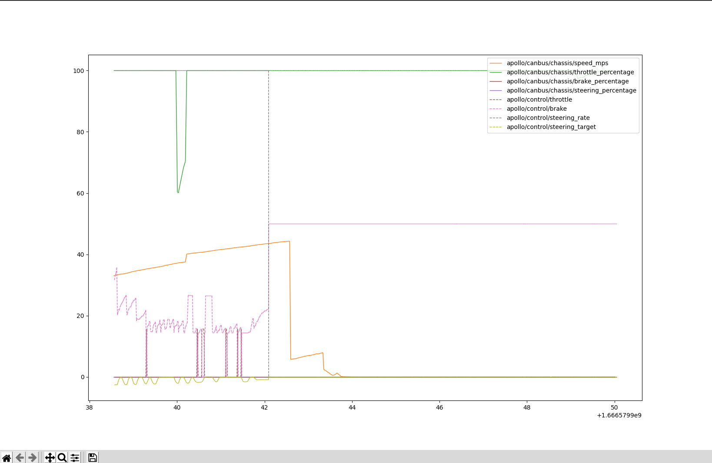

# cyber_draw
/apollo/control and /apollo/canbus/chassis virualization tool

## Install
You can install `ipath` by below cmd.
```shell
gti clone 
cd dist
pip install cyber_draw-1.0.tar.gz
```

## Virualization
Then we can use below cmd to draw figure from cyber_draw
```
cyber_draw -f 20221024105118.record.00001
```

